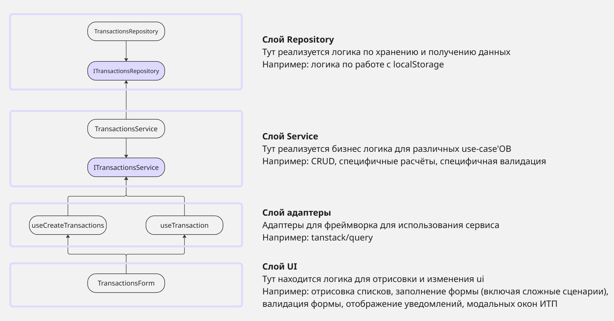

# Архитектура
Архитектура UI-слоя проекта основана на компонентом подходе (из fsd).
Архитектура слоя бизнес-логики и хранения данных основана на чистой архитектуре.



# Работа с модулями и зависимостями

Для корректного tree-shaking и упрощения рефакторинга:
 - Внутри модуля используются относительные импорты
 - Между модулями используются импорты относительно src (@/*)
 - Модуль должен иметь public api

Для упрощения восприятия:
 - Импорты в файле организуются следующим образом:
```
// Зависимости от внешних библиотек
import {useFormContext} from "react-hook-form";

// Зависимости от других модулей
import {useCreateTransaction} from "@/entities/transaction";
import {Button} from "@/shared/ui/button";

// Зависимости внутри модуля
import type {TransactionsFormState} from "../../../model/schema";
```


